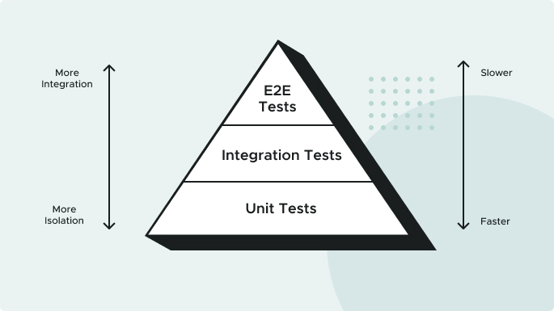
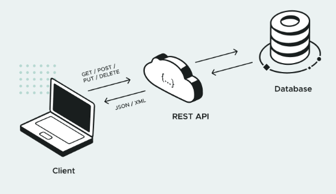
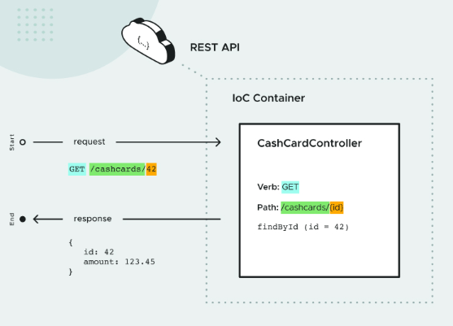
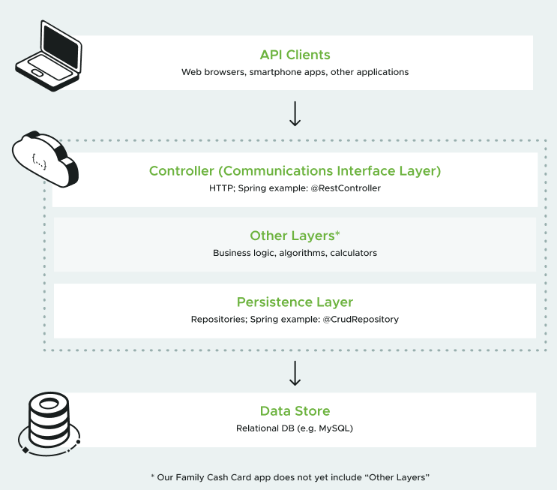
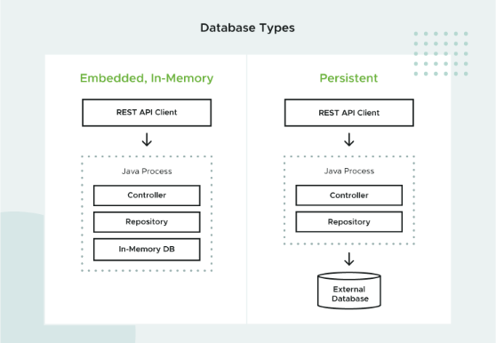
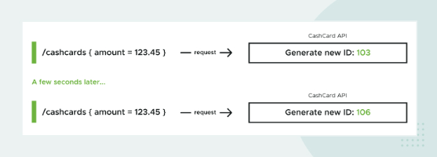

# 🌱 Spring and Spring Boot Overview

Spring and Spring Boot are Java frameworks that help developers build applications in an efficient and scalable way. Think of them as toolkits for organizing and structuring code.

## 🌼 Spring

Spring is a **comprehensive framework** that offers a variety of modules to support different types of applications.

For this project **Cash Card API**, we use:
- **Spring MVC** for the web app
- **Spring Data** for data access
- **Spring Security** for authentication and authorization

> ⚠️ Spring's versatility can make setup a bit complex. Developers often need to configure different components manually to get everything running.

## 🚀 Spring Boot

Spring Boot simplifies the Spring experience! 🧰 It like an **opinionated version of Spring**—it comes with many pre-configured settings and dependencies commonly used in Spring apps. This makes it super easy to get started without manual setup.

Spring Boot includes an **embedded web server**— we don’t need an external server to deploy web apps.

### Summary
- **Spring:** Powerful, flexible but can be overwhelming.
- **Spring Boot:** Streamlined, fast to set up, with many built-in features.

## 🔄 Spring's Inversion of Control Container

Spring Boot utilizes Spring Core’s **Inversion of Control (IoC) container**. This feature will be essential for this application.

💡 **Inversion of Control** gives you flexibility with dependencies. You can specify different configurations for different scenarios (e.g., local development vs. production database) without hard-coding.

- Often, **dependency injection (DI)** is used within IoC, although not exactly the same thing.
- In Spring, the terms are often used interchangeably.

More about [Spring’s IoC Container](https://docs.spring.io/spring-framework/reference/core/beans.html) in the official docs.

## 🛍️ Spring Initializr

When starting a new Spring Boot project, **Spring Initializr** is the way to go. It is where you configure what you need and select dependencies for the app.

- Fill in project metadata, add dependencies, and generate a complete, ready-to-run **Spring Boot application**.

---

# 🌐 API Contracts & JSON

How should the API behave?

- How should API consumers interact with the API?
- What data do consumers need to send in various scenarios?
- What data should the API return to consumers, and when?
- What does the API communicate when it's used incorrectly (or something goes wrong)?

We should document these agreements not only in a shared documentation system, but also in a way that supports automated tests passing (or failing) based upon these decisions.

This is where the concept of contracts comes in.

## 🤝 API Contracts
The software industry has adopted several patterns for capturing agreed-upon API behavior in documentation and code. These agreements are often called "contracts". Two examples include Consumer Driven Contracts and Provider Driven Contracts. 

We define an API contract as a formal agreement between a software provider and a consumer that abstractly communicates how to interact with each other. This contract defines how API providers and consumers interact, what data exchanges looks like, and how to communicate success and failure cases.

The provider and consumers do not have to share the same programming language, only the same API contracts. For this project, there's one contract between the Cash Card service and all services using it. Below is an example of that first API contract.
```text
   Request
       URI: /cashcards/{id}
       HTTP Verb: GET
       Body: None
   
   Response:
       HTTP Status:
           200 OK if the user is authorized and the Cash Card was successfully retrieved
           401 UNAUTHORIZED if the user is unauthenticated or unauthorized
           404 NOT FOUND if the user is authenticated and authorized but the Cash Card cannot be found
       Response Body Type: JSON
       Example Response Body:
           {
           "id": 99,
           "amount": 123.45
           }
```

### 💡 Why Are API Contracts Important?
API contracts are important because they communicate the behavior of a REST API. They provide specific details about the data being serialized (or deserialized) for each command and parameter being exchanged. The API contracts are written in such a way that can be easily translated into API provider and consumer functionality, and corresponding automated tests.

## 📄 What Is JSON?
JSON (Javascript Object Notation) provides a data interchange format that represents the particular information of an object in a format that you can easily read and understand.

```json
{
  "id": 99,
  "amount": 123.45
}
```
Other popular data formats include YAML (Yet Another Markup Language) and XML (Extensible Markup Language). When compared to XML, JSON reads and writes quicker, is easier to use, and takes up less space. You can use JSON with most modern programming languages and on all major platforms. It also works seamlessly with Javascript-based applications.

For these reasons, JSON has largely superseded XML as the most widely used format for APIs used by Web apps, including REST APIs.

---

# 🧪 Testing First

## What Is Test Driven Development (TDD)?

Typically, automated tests are written **after** the application feature code, but in **Test Driven Development (TDD)**, tests are written **first**! By defining expected behavior before implementation, TDD helps us design the system based on what we **want it to do**, rather than what it already does.

### 🔍 Why Use TDD?
- TDD ensures we write only the **minimum code** necessary to meet the requirements.
- Passing tests mean both working code and a safeguard against future regressions.

## 📐 The Testing Pyramid

Different types of tests have unique roles and impact at various levels of the system. Balancing **speed**, **maintenance cost**, and **confidence** forms the “testing pyramid”:


1. **Unit Tests**:
    - **Scope**: Tests isolated “units” of the system.
    - **Characteristics**: Simple, fast, and abundant.
    - **Purpose**: Essential for designing cohesive, loosely coupled software.

2. **Integration Tests**:
    - **Scope**: Tests a group of units working together.
    - **Characteristics**: Slower and more complex than unit tests.
    - **Purpose**: Ensures components interact correctly.

3. **End-to-End Tests**:
    - **Scope**: Tests the entire system from the user’s perspective.
    - **Characteristics**: Slow, often fragile, but thorough.
    - **Purpose**: Validates that the system works as a whole.

## 🔄 The Red, Green, Refactor Loop

How can development teams **move fast and stay reliable**? By continuously **refactoring** to keep code clean and manageable, supported by a solid test suite. The **Red, Green, Refactor loop** is central to TDD:

- **Red**: Write a failing test that defines the desired functionality.
- **Green**: Implement the simplest solution to make the test pass.
- **Refactor**: Simplify and improve code without changing functionality.

🔁 **Repeat** until you’ve built the functionality you need, with robust tests to back it up!

---

# 🌐 Implementing GET with REST and Spring Boot


## What Are REST, CRUD, and HTTP? 

### 🌀REST: Representational State Transfer 
- A RESTful system manages the **state** of resources, known as **Resource Representations**.
- REST focuses on managing **values of resources** (data objects) through an API, which are often stored in databases..️

### 🛠️CRUD: Basic Operations 
- CRUD stands for **Create, Read, Update, and Delete**—the four basic actions for manipulating data.
- REST prescribes specific HTTP methods to perform these actions.

### 🌐HTTP in RESTful APIs 
- **HTTP** (Hypertext Transfer Protocol) facilitates the data flow in REST by allowing a **Request** to be sent to a **URI**, with a **Response** generated in return. 🔁

### 📨Components of HTTP Requests and Responses 

#### Request 
- **Method** (Verb like GET, POST)
- **URI** (Endpoint)
- **Body**

#### Response
- **Status Code** (indicates success or failure)
- **Body** (contains data if applicable)

## 🧰RESTful CRUD Operations with HTTP Methods 

When building REST APIs, each CRUD operation has a designated **HTTP method** and **status code** response, as shown below:

| 🛠️ Operation | 🌐 API Endpoint       | 📬 HTTP Method | 🔔 Response Status |
|--------------|------------------------|----------------|---------------------|
| **Create**   | `/cashcards`           | **POST**       | 201 (CREATED)       |
| **Read**     | `/cashcards/{id}`      | **GET**        | 200 (OK)            |
| **Update**   | `/cashcards/{id}`      | **PUT**        | 204 (NO CONTENT)    |
| **Delete**   | `/cashcards/{id}`      | **DELETE**     | 204 (NO CONTENT)    |

### Key Concepts 💡
- **Endpoint URI**: `/cashcards` for **Cash Card** objects.
- **READ, UPDATE, DELETE** operations require a **unique identifier** (`{id}`) to specify the target resource.
   - Example: `/cashcards/42` references the Cash Card with ID `42`.
- **CREATE** operations do **not** require an ID, as a unique identifier will be generated upon creation.

---

# 📥 The Request Body

When following **REST** conventions for **CREATE** or **UPDATE** operations, we need to submit data to the **API** through the request body. This **request body** contains the data necessary to either create or update a resource.

- For example, when creating a new **Cash Card**, the body might include an initial cash amount, and for **UPDATE**, the request body would specify the changes to the cash value.

# 💳 Cash Card Example

For a **READ** operation, the **URI (endpoint)** path format is `/cashcards/{id}`, where `{id}` is replaced by the actual **Cash Card ID** (without braces), and the **HTTP method** used is **GET**.

- **GET requests**: The body of a GET request remains empty.

```text
Request:
  Method: GET
  URL: http://cashcard.example.com/cashcards/123
  Body: (empty)
```

The response to a successful Read request has a body containing the JSON representation of the requested Resource, with a Response Status Code of 200 (OK). Therefore, the response to the above Read request would look like this:
```json
{
   "Request": {
      "Method": "GET",
      "URL": "http://cashcard.example.com/cashcards/123",
      "Body": ""
   }
}
```

---

# 🌱 REST in Spring Boot

# 📝 Spring Annotations and Component Scan

**Spring** creates and configures objects called **Beans**, often instantiated by Spring itself rather than with Java's `new` keyword. There are several ways to instruct Spring to create Beans.

- One way is to use **Spring Annotations**. This directs **Spring** to create an instance of the class during **Component Scan** at application startup.
- The Bean is then stored in **Spring's IoC container** and can be **injected** into any other code that requires it.

## 🌐 Spring Web Controllers

In **Spring Web**, incoming **Requests** are managed by **Controllers**:
```java
@RestController
class CashCardController {
}
```
- Marking a class with **@RestController** directs Spring to create an instance of the class during Spring’s Component Scan phase. This happens at application startup. 
- The Bean is stored in Spring’s IoC container. From here, the bean can be injected into any code that requests it.

Spring routes requests to the **Controller** based on incoming **API requests**, and routes each to the appropriate handler method.



## 🖥️ Creating a Read Request Handler Method
A Controller method can be designated a handler method, to be called when a request that the method knows how to handle (called a “matching request”) is received.
```java
private CashCard findById(Long requestedId) {
}
```
To handle **Read** operations:
1. Since REST specifies that **READ endpoints** should use **GET**, you need to tell **Spring** to route only **GET requests** to this method.
2. Use the **@GetMapping** annotation and specify the **URI path**.
```java
@GetMapping("/cashcards/{requestedId}")
private CashCard findById(Long requestedId) {
}
```

## 🔄 Mapping Request Parameters

**Spring** must know how to retrieve the **requestedId** parameter value. This is done using the **@PathVariable** annotation. Because the parameter name matches `{requestedId}` in the **@GetMapping** URI path, Spring can correctly **assign** the value to **requestedId**.
```java
@GetMapping("/cashcards/{requestedId}")
private CashCard findById(@PathVariable Long requestedId) {
}
```

## 📤 Returning the Response

REST specifies that the **Response** should contain:
- A **Cash Card** in the **body**
- A **Response Code** of `200 (OK)`

**Spring Web** provides the **ResponseEntity** class for this purpose, which includes utility methods to produce **Response Entities**. To create a **ResponseEntity** with a `200` status and a **CashCard** body, use:
The final implementation looks like this:

```java
@RestController
class CashCardController {
   @GetMapping("/cashcards/{requestedId}")
   private ResponseEntity<CashCard> findById(@PathVariable Long requestedId) {
      CashCard cashCard = /* Here would be the code to retrieve the CashCard */;
      return ResponseEntity.ok(cashCard);
   }
}
```

---

# 📦 Repositories & Spring Data

If we to return real data, from a database, Spring Data works with Spring Boot to make database integration simple.

## 🏗️ Controller-Repository Architecture

The **Separation of Concerns** principle states that well-designed software should be modular, with each module having distinct and separate concerns from any other module.

If we have hard-coded response from the Controller, this setup violates the Separation of Concerns principle by mixing the concerns of a Controller, which is an abstraction of a web interface, with the concerns of reading and writing data to a data store, such as a database. 
- To avoid this we use a common software architecture pattern to enforce data management separation via the Repository pattern.

A common architectural framework that divides these layers, typically by function or value, such as business, data, and presentation layers, is called **Layered Architecture**. 
- The Repository and Controller are two layers in a Layered Architecture. 
  - The Controller is in a layer near the Client (as it receives and responds to web requests) while the Repository is in a layer near the data store (as it reads from and writes to the data store).
  - There may be intermediate layers as well, as dictated by business needs. We don't need any additional layers, at least not yet!

The Repository is the interface between the application and the database, and provides a common abstraction for any database, making it easier to switch to a different database when needed.



Spring Data provides a collection of robust data management tools, including implementations of the Repository pattern.

## 💾 Choosing a Database

In this project we use an **embedded, in-memory database**. 
- “Embedded” simply means that it’s a Java library, so it can be added to the project just like any other dependency.
- “In-memory” means that it stores data in memory only, as opposed to persisting data in permanent, durable storage. 
- At the same time, our in-memory database is largely compatible with production-grade relational database management systems (RDBMS) like MySQL, SQL Server, and many others. Specifically, it uses JDBC (the standard Java library for database connectivity) and SQL (the standard database query language).



### 🔄 In Memory Embedded vs External Database

There are tradeoffs to using an in-memory database instead of a persistent database. 
- On one hand, in-memory allows you to develop without installing a separate RDBMS, and ensures that the database is in the same state (i.e., empty) on every test run.
- However, you do need a persistent database for the live "production" application. This leads to a **Dev-Prod Parity** mismatch: Your application might behave differently when running the in-memory database than when running in production.

This project uses H2, it is highly compatible with other relational databases, so dev-prod parity won’t be a big issue.

## ⚙️ Auto Configuration
All we need for full database functionality is to add two dependencies. Showing one of the most powerful features of Spring Boot: Auto Configuration.
- Without Spring Boot, we’d have to configure Spring Data to speak to H2. 
- However, because we’ve included the Spring Data dependency (and a specific data provider, H2), Spring Boot will automatically configure your application to communicate with H2.

## 🔄 Spring Data’s CrudRepository
This project uses a specific type of Repository: Spring Data’s CrudRepository.

Complete implementation of all CRUD operations by extending CrudRepository:
```java
interface CashCardRepository extends CrudRepository<CashCard, Long> {
}
```
With the above code, a caller can call any number of predefined CrudRepository methods, such as findById:
```java
cashCard = cashCardRepository.findById(99);
```
CrudRepository and everything it inherits from is an Interface with no actual code.
- Based on the specific Spring Data framework used (here Spring Data JDBC) Spring Data takes care of this implementation for us during the IoC container startup time.
- The Spring runtime will then expose the repository as yet another bean that you can reference wherever needed in your application.

There are trade-offs. 
- For example the CrudRepository generates SQL statements to read and write your data, which is useful for many cases, but sometimes you need to write your own custom SQL statements for specific use cases.

---

# 🚀 Implementing POST

1. **Who specifies the ID** - the client, or the server?
2. **In the API Request**, how do we represent the object to be created?
3. **Which HTTP method should we use in the Request?**
4. **What does the API send as a Response?**

- “Who specifies the ID?” 
  - In reality, this is up to the API creator! REST is not exactly a standard; it’s merely a way to use HTTP to perform data operations.

The simplest solution is to let the server create the ID. Databases are efficient at managing unique IDs. Other alternatives include:

- We could require the client to provide the ID. This might make sense if there were a pre-existing unique ID, but that’s not the case.
- We could allow the client to provide the ID optionally (and create it on the server if the client does not supply it). The [Yagni article](https://martinfowler.com/bliki/Yagni.html) explains why this isn't a good idea.

## 🔁 Idempotence and HTTP

An idempotent operation is defined as one which, if performed more than once, results in the **same** outcome. 
- In a REST API, an idempotent operation is one that even if it were to be performed several times, the resulting data on the server would be the same as if it had been performed only once.

For each method, the HTTP standard specifies whether it is idempotent or not. 
- GET, PUT, and DELETE are idempotent, whereas POST and PATCH are not.

The server will create IDs for every Create operation, so the Create operation in this API is **NOT idempotent**. Since the server will create a new ID (on every Create request), if you call Create twice - even with the same content - you’ll end up with two different objects with the same content, but with different IDs. 
- To summarize: **Every Create request will generate a new ID, thus no idempotency**.



REST permits POST as one of the proper methods to use for Create operations, the one used here.

## 📤📥 The POST Request and Response

### 📤The Request

The POST method allows a Body, so we'll use the Body to send a JSON representation of the object:

Request:
- Method: POST
- URI: /cashcards/
- Body:
```json
{
    "amount": 123.45
}
```
- The GET operation includes the ID of the Cash Card in the URI, but not in the request Body.

There no ID in the Request because we decided to allow the server to create the ID. Thus, the data contract for the Read operation is different from that of the Create operation.

### 📥The Response

On successful creation, the most accurate HTTP Response Status Code for REST APIs is: **201 CREATED**.
- In this case, a response code of 200 OK does not answer the question “Was there any change to the server data?”. By returning the 201 CREATED status, the API is specifically communicating that data was added to the data store on the server.

To recap, an HTTP Response contains two things: a Status Code, and a Body. But that’s not all. 
- A Response also contains Headers. Headers have a name and a value. The HTTP standard specifies that the Location header in a 201 CREATED response should contain the URI of the created resource. 
- This is handy because it allows the caller to easily fetch the new resource using the GET endpoint (the one we implemented prior).

Response:
- Status Code: 201 CREATED
- Header: Location=/cashcards/42

## 📡 Spring Web Convenience Methods

In this project, we use the `ResponseEntity.created(uriOfCashCard)` method to create a response. 
- This method requires you to specify the location, ensures the Location URI is well-formed (by using the URI class), adds the Location header, and sets the Status Code for you.
- And by doing so, this saves us from using more verbose methods. For example, the following two code snippets are equivalent (as long as uriOfCashCard is not null):
```java
return  ResponseEntity
        .created(uriOfCashCard)
        .build();
```
Versus:
```java
return ResponseEntity
        .status(HttpStatus.CREATED)
        .header(HttpHeaders.LOCATION, uriOfCashCard.toASCIIString())
        .build();
```

---

# 📜 Returning a List with GET

## 🔄 Requesting a List of Cash Cards

This **API** should be able to return multiple **Cash Cards** in response to a single **REST request**.

## 📑 The Data Contract

When you make an **API request** for several **Cash Cards**, you’d ideally make a single request that returns a list of **Cash Cards**. We need a new **data contract**.
- Instead of a single **Cash Card**, the new contract should specify that the response is a **JSON Array** of **Cash Card objects**.

Example response:
```json
[
    {
        "id": 1,
        "amount": 123.45
    },
    {
        "id": 2,
        "amount": 50.0
    }
]
```

---

**CrudRepository**, has a **findAll** method that can be used to easily fetch all the **Cash Cards** in the database.
```java
@GetMapping()
private ResponseEntity<Iterable<CashCard>> findAll() {
   return ResponseEntity.ok(cashCardRepository.findAll());
}
```

---

🤔 However, it turns out there’s a lot more to this operation than just returning all the **Cash Cards** in the database.
- **How do I return only the Cash Cards that the user owns?**.
- **What if there are hundreds (or thousands?!) of Cash Cards?** Should the API return an unlimited number of results or return them in “chunks”?
- **Should the Cash Cards be returned in a particular order (i.e., should they be sorted)?**

## 📄 Pagination and Sorting

We use a specialized version of the `CrudRepository`, called the `PagingAndSortingRepository`.

- **Paging** functionality.
  - Ideally, an API should not be able to produce a response with unlimited size, because this could overwhelm the client or server memory, not to mention taking quite a long time.
  - To ensure that an API response doesn’t include an astronomically large number of Cash Cards, we utilize Spring Data’s pagination functionality. **Pagination** in Spring (and many other frameworks) specifies the page length (e.g., 10 items) and the page index (starting with 0). For example:
      - If a user has 25 Cash Cards, and you elect to request the second page where each page has 10 items, you would request a page of size 10, and page index of 1.

For pagination to produce the correct page content, the items must be sorted in some specific order. Why?

- Imagine we have a bunch of Cash Cards with the following amounts:
    - $0.19
    - $1,000.00
    - $50.00
    - $20.00
    - $10.00

Here is an example using a page size of 3. Since there are 5 Cash Cards, we’d make two requests to return all of them. Page 1 (index 0) contains three items, and page 2 (index 1, the last page) contains 2 items.

- If we specify that the items should be **sorted by amount in descending order**, then this is how the data is paginated:

  **Page 1:**
    - $1,000.00
    - $50.00
    - $20.00

  **Page 2:**
    - $10.00
    - $0.19

### ❓ Regarding Unordered Queries

- Although Spring provides an “unordered” sorting strategy, let’s be explicit when we select which fields for sorting. Why?
    - Imagine you elect to use “unordered” pagination. In reality, the order is not random but predictable; it never changes on subsequent requests.
    - Let’s say you make a request, and Spring returns the following “unordered” results:

      **Page 1:**
        - $0.19
        - $1,000.00
        - $50.00

      **Page 2:**
        - $20.00
        - $10.00

Although they look random, every time you make the request, the cards will come back in exactly this order, so each item is returned on exactly one page.

- If we create a new Cash Card with an amount of $42.00. Which page will it be on? There’s no way to know other than making the request and seeing where the new Cash Card lands.

- It's more useful to opt for ordering by a specific field. **There are a few good reasons to do so:**
    - Minimize cognitive overhead: Other developers (not to mention users) will probably appreciate a thoughtful ordering.
    - Minimize future errors: What happens when a new version of Spring, Java, or the database suddenly causes the “random” order to change overnight?

### 🔍 Spring Data Pagination API

Spring Data provides the `PageRequest` and `Sort` classes for pagination.

```java
Page<CashCard> page2 = cashCardRepository.findAll(
    PageRequest.of(
        1,  // page index for the second page - indexing starts at 0
        10, // page size (the last page might have fewer items)
        Sort.by(new Sort.Order(Sort.Direction.DESC, "amount"))));
```

## 📄 The Request and Response

### **We use Spring Web to extract the data to feed the pagination functionality:**

- **Pagination**: Spring can parse out the page and size parameters if you pass a `Pageable` object to a `PagingAndSortingRepository` `find...()` method.

- **Sorting**: Spring can parse out the sort parameter, which consists of the field name and direction separated by a comma. ⚠️ **No space before or after the comma is allowed!** Again, this data is part of the `Pageable` object.

### 🌐 The URI

**Step-by-step for composing a URI for the new endpoint** (omitting the `https://domain` prefix).

1. Get the second page
```text
/cashcards?page=1
```
2. ...where a page has length of 3
```text
/cashcards?page=1&size=3
```
3. ...sorted by the current Cash Card balance
```text
/cashcards?page=1&size=3&sort=amount
```
4. ...in descending order (highest balance first)
```text
/cashcards?page=1&size=3&sort=amount,desc
```

### 🖥️ The Java Code

**Here’s the complete implementation of the Controller method for the new “get a page of Cash Cards” endpoint:**
```java
@GetMapping
private ResponseEntity<List<CashCard>> findAll(Pageable pageable) {
   Page<CashCard> page = cashCardRepository.findAll(
           PageRequest.of(
                   pageable.getPageNumber(),
                   pageable.getPageSize(),
                   pageable.getSortOr(Sort.by(Sort.Direction.DESC, "amount"))));
   return ResponseEntity.ok(page.getContent());
}
```

### 🔍 Detail analysis:

- **First, let’s parse the needed values out of the query string:**
    - `Pageable` allows Spring to parse out the page number and size query string parameters.
      - **Note**: If the caller doesn’t provide the parameters, Spring provides defaults: `page=0`, `size=20`.
    - We use `getSortOr()` so that even if the caller doesn’t supply the sort parameter, there is a default. Unlike the page and size parameters, for which it makes sense for Spring to supply a default, it wouldn’t make sense for Spring to arbitrarily pick a sort field and direction.
    - We use the `page.getContent()` method to return the Cash Cards contained in the `Page` object to the caller.

So, what does the `Page` object contain besides the Cash Cards? Here's the `Page` object in JSON format. The Cash Cards are contained in the `content`. The rest of the fields contain information about how this Page is related to other Pages in the query.
```json
{
  "content": [
    {
      "id": 1,
      "amount": 10.0
    },
    {
      "id": 2,
      "amount": 0.19
    }
  ],
  "pageable": {
    "sort": {
      "empty": false,
      "sorted": true,
      "unsorted": false
    },
    "offset": 3,
    "pageNumber": 1,
    "pageSize": 3,
    "paged": true,
    "unpaged": false
  },
  "last": true,
  "totalElements": 5,
  "totalPages": 2,
  "first": false,
  "size": 3,
  "number": 1,
  "sort": {
    "empty": false,
    "sorted": true,
    "unsorted": false
  },
  "numberOfElements": 2,
  "empty": false
}
```

Although we could return the entire Page object to the client, we don't need all that information. We'll define our data contract to only return the Cash Cards, not the rest of the Page data.

---

# 🔒 Simple Spring Security

**Software Security** can mean many things, encompassing a wide range of topics. The focus here is on **Web Security**—specifically, how HTTP Authentication and Authorization work, common vulnerabilities in the web ecosystem, and how Spring Security can prevent unauthorized access to our service.

### 🔑 **Authentication**

- A user of an API can be a person or another program, so we often use the term **Principal** as a synonym for “user”.

- **Authentication** is the act of a Principal proving its identity to the system, often by providing credentials (e.g., username and password using Basic Authentication).

- Once credentials are verified, the Principal is **authenticated** (or “logged in”).

- Since HTTP is a **stateless protocol**, each request must prove it’s from an authenticated Principal. Although credentials could be sent on each request, it’s inefficient. Instead, an **Authentication Session** is created once authenticated.

    - Here we use a **Session Token**. A random string generated and placed in a Cookie, which is stored on the client.

    - **Cookies**: A Cookie is a set of data stored in a web client (such as a browser), and associated with a specific URI.
        - Are automatically sent to the server with every request. As long as the server checks that the Token in the Cookie is valid, unauthenticated requests can be rejected.
        - Cookies can persist for a certain amount of time even if the web page is closed and later re-visited. This ability typically improves the user experience of the website.

### 🛡️ **Spring Security and Authentication**

Spring Security implements authentication in the Filter Chain. The Filter Chain is a component of Java web architecture which allows programmers to define a sequence of methods that get called prior to the Controller. 
Each filter in the chain decides whether to allow request processing to continue, or not.

- **Spring Security’s Filter**:
    - Checks if a user’s request is authenticated.
    - If not, it returns a `401 UNAUTHORIZED` response, stopping further request processing.

### 📝 **Authorization**

- After authentication, **Authorization** allows different users to have different permissions within the system.

- **Spring Security Authorization**:
    - Uses **Role-Based Access Control (RBAC)**.
    - Each Principal has **Roles**, which determine access to specific resources or actions.
    - For example, an **Administrator Role** might allow more actions than a **Card Owner Role**.
    - Authorization can be configured both globally and per method.

### 🔒 **Same Origin Policy**

The web poses risks where malicious actors seek to exploit vulnerabilities. **Same Origin Policy (SOP)** provides basic protection by ensuring that only scripts within a web page can send requests to its origin URI.

- **Why SOP Is Critical**: SOP prevents unauthorized scripts from sending requests to other sites. Without SOP, any web page could potentially send malicious requests to other sites where a user is authenticated.

- **Example**: Imagine a user is logged into a bank account and then opens a malicious web page in a separate tab. If SOP weren’t enforced, that page could send harmful requests to the bank, potentially initiating actions like unauthorized withdrawals.

## 🌍 **Cross-Origin Resource Sharing (CORS)**

- When systems involve **multiple services running on different URIs** (like in microservices architecture), it’s necessary to allow controlled cross-origin requests.

- **CORS** provides a way for browsers and servers to cooperate in relaxing SOP under controlled circumstances:
    - Allows a server to specify **allowed origins** of requests.
    - **Spring Security** supports CORS with the `@CrossOrigin` annotation, which specifies allowed sites.
        - **Be cautious**: Using `@CrossOrigin` without specifying allowed origins will open up access to all origins!

## 🔍 **Common Web Exploits**

Along with exploiting known security vulnerabilities, malicious actors on the web are also constantly discovering new vulnerabilities. Spring Security provides a powerful tool set to guard against common security exploits. 

### 🌊 **Cross-Site Request Forgery (CSRF)**

- **CSRF (or "Sea-Surf")**, also known as Session Riding, attacks occur when a malicious script sends unauthorized requests to a server where the user is authenticated. These attacks exploit Cookies and Auth Tokens stored in the browser. When the server receives the Authentication Cookie, it has no way of knowing if the victim sent the harmful request unintentionally.
- **CSRF Protection**: Use a **CSRF Token**, a unique token generated for each request. Unlike Auth Tokens, CSRF Tokens change with each interaction, making it difficult for attackers to predict and insert malicious requests.

- **Spring Security CSRF Protection**: Enabled by default in Spring Security, CSRF Tokens safeguard against unauthorized requests, preventing outside actors from inserting malicious requests.

### 📝 **Cross-Site Scripting (XSS)**

- **XSS Attacks**: This occurs when an attacker is somehow able to “trick” the victim application into executing arbitrary code. For example, saving a string in a database containing a `<script>` tag  and then waiting until the string is rendered on a web page, resulting in the script being executed.

- **XSS vs. CSRF**: XSS can be even more dangerous because:
    - XSS enables the execution of arbitrary code (not limited to the user’s permissions).
    - It does not rely on authentication but instead exploits poor security practices.

- **XSS Prevention**: Securely handle and sanitize all data from external sources, including form inputs and query strings. Escaping special characters (e.g., HTML `<script>` tags) can prevent scripts from executing.

---

# 📝 Implementing PUT

How to implement the Update operation in a RESTful API.

When we say **“adjust the balance”** on a Cash Card, what we really mean is to update the amount on an existing database record. Doing so will entail:

- Creating a new endpoint to receive an HTTP request with a verb, URI, and body
- Returning an appropriate response from the endpoint for success and error conditions

**POST**, **PUT** and **PATCH**, and how all three of these are related.

## 🔄 PUT and PATCH

Both **PUT** and **PATCH** can be used for updating, but they work in different ways. Essentially:

- **PUT** means “create or replace the complete record”
- **PATCH** means “update only some fields of the existing record” – in other words, a partial update.

Why would you want to do a partial update? Partial updates free the client from having to load the entire record and then transmit the entire record back to the server. If the record is large enough, this can have a non-trivial impact on performance.

For this application, we chose **not** to implement a partial update.

## 🆚 PUT and POST

The **HTTP standard doesn't specify** whether the POST or PUT verb is preferred for a Create operation!
This is relevant because here we use the PUT verb for our Update endpoint, so we need to decide whether our API supports using **PUT to either Create or Update** a resource.

There are different ways to look at the relationship between the **Create** and **Update** operations and how they're implemented in REST using HTTP verbs.

### 🔑 Surrogate and Natural Keys

Why would we want to use a **PUT** operation to create a resource? This has to do with the HTTP definition of the two verbs. The difference is subtle. Let’s explain it by comparing two different systems: Our **Cash Card API**, and another API that we'll introduce for explanatory purposes, called the **Invoice API**. The Invoice API accepts the **Invoice Number as the unique identifier**. This is an example of using a **Natural Key** (supplied by the client to the API) instead of a **Surrogate Key** (usually generated by the server, which is what we're doing in our Cash Card API).

The important difference is whether the **URI** (which includes the ID of the resource) needs to be generated by the server or not. Here is how **PUT** and **POST** think about it:

- If you need the server to return the URI of the created resource (or the data you use to construct the URI), then you must use **POST**.
    - This is the case for our Cash Card API: To create a Cash Card, we provide the `POST /cashcards` endpoint. The actual URI for the created Cash Card depends on the generated ID and is provided by the server, for example, `/cashcards/101` if the ID of the created card is 101.

- Alternatively, when the resource URI is known at creation time (as in our example Invoice API), you can use **PUT**.
    - For the Invoice API, we could write a Create endpoint that accepts requests such as `PUT /invoice/1234-567`. The corresponding Read call would use the exact same URI: `GET /invoice/1234-567`.

### 🗂 Resources and Sub-Resources

Another way to look at the difference is in terms of **URIs and collections of sub-resources**. This is the language used by the HTTP documentation, so it's good to be familiar with it. Following the above examples, we’d find:

- **POST** creates a **sub-resource** (child resource) under (after), or within the request URI. This is what the Cash Card API does: The client calls the Create endpoint at `POST /cashcards`, but the actual URI of the created resource contains a generated ID at the end: `/cashcards/101`.

- **PUT** creates or replaces (updates) a **resource at a specific request URI**. For the `/invoice` example above, the Create endpoint would be `PUT /invoice/1234-567`, and the URI of the created resource would be the same as the URI sent in the **PUT** request.

## 📤 Response Body and Status Code

When deciding whether to allow **PUT** to create objects, we need to consider what the **response status code** and **body** should be. Here are two common options:

- **Option 1**: Return **201 CREATED** (if you created the object), or **200 OK** (if you replaced an existing object). In this case, it's recommended to return the object in the response body. This is useful if data was added to the object by the server (e.g., if the server records the creation date).

- **Option 2**: Return **204 NO CONTENT**, with an empty response body. The rationale here is that since a **PUT** simply places an object at the URI in the request, the client doesn't need any information back – it knows that the object in the request has been saved, verbatim, on the server.

## 🧩 POST, PUT, PATCH and CRUD Operations - Summary

| HTTP Method | Operation | Definition of Resource URI       | What does it do?                                             | Response Status Code | Response Body         |
|-------------|-----------|----------------------------------|--------------------------------------------------------------|-----------------------|------------------------|
| **POST**    | Create    | Server generates and returns URI | Creates a sub-resource ("under" or "within" the passed URI)   | **201 CREATED**       | **The created resource** |
| **PUT**     | Create    | Client supplies the URI          | Creates a resource (at the Request URI)                       | **201 CREATED**       | **The created resource** |
| **PUT**     | Update    | Client supplies the URI          | Replaces the resource: The entire record is replaced by the object in the request | **204 NO CONTENT** | **(empty)** |
| **PATCH**   | Update    | Client supplies the URI          | Partial Update: modify only fields included in the request on the existing record | **200 OK**            | **The updated resource** |

## 🔒 Security

Another decision we’ll make is how to apply **security logic** to the new **Update** operation.

We decided to return **404 NOT FOUND** for **GET** requests in two cases: nonexistent IDs, and attempted access to cards for which the user isn’t authorized. We’ll use the same strategy for the **Update** endpoint, for similar reasons (which we’ll go into more detail about in the lab).

## 📝 Our API Decisions

To summarize:

- **PUT** won’t support creating a Cash Card.
- Our new **Update** endpoint (which we'll build in the upcoming Lab):
    - will use the **PUT** verb.
    - accepts a **Cash Card** and replaces the existing Cash Card with it.
    - on success, will return **204 NO CONTENT** with an empty body.
    - will return **404 NOT FOUND** for an unauthorized update, as well as attempts to update nonexistent IDs.

---

# 🗑️ Implementing DELETE

The last of the four CRUD operations: **Delete**! What’s the API’s data specification for the **Delete** endpoint? The specification includes the details of the **Request** and **Response**.

### Request:
- **Verb**: DELETE
- **URI**: /cashcards/{id}
- **Body**: (empty)

### Response:
- **Status Code**: **204 NO CONTENT**
- **Body**: (empty)

We’ll return the **204 NO CONTENT** status code for a successful delete, but there are additional cases:

| **Response Code**    | **Use Case**                                                        |
|----------------------|---------------------------------------------------------------------|
| **204 NO CONTENT**   | The record exists, and the Principal is authorized, and the record was successfully deleted. |
| **404 NOT FOUND**     | The record does not exist (a non-existent ID was sent).            |
| **404 NOT FOUND**     | The record does exist, but the Principal is not the owner.          |

We return **404** for the "ID does not exist" and "not authorized to access this ID" in order to not "leak" information: If the API returned different results for the two cases, then an unauthorized user would be able to discover specific IDs that they're not authorized to access.

## 🛠️ Hard and Soft Delete

So, what does it mean to delete a Cash Card from a database’s point of view? We need to decide what happens to resources when they are deleted.

A simple option, called **hard delete**, is to delete the record from the database. With a hard delete, it’s gone forever.

An alternative is **soft delete**, which works by marking records as "deleted" in the database (so that they're retained, but marked as deleted). For example, we can introduce an **IS_DELETED** boolean or a **DELETED_DATE** timestamp column and then set that value instead of fully removing the record by deleting the database row(s). With a soft delete, we also need to change how Repositories interact with the database. For example, a repository needs to respect the “deleted” column and exclude records marked deleted from **Read** requests.

## 📝 Audit Trail and Archiving

When working with databases, there’s often a requirement to keep a record of modifications to data records. For example:

- A customer service representative might need to know when a customer deleted their Cash Card.
- There may be data retention compliance regulations which require deleted data to be retained for a certain period of time.

If the Cash Card is hard-deleted, then we'd need to store additional data to be able to answer these questions.

### Options to Record Historical Information

1. **Archive (move) the deleted data into a different location**:
    - This involves transferring data to a secure location for long-term storage while removing it from active use.

2. **Add audit fields to the record itself**:
    - For example, the **DELETED_DATE** column that we mentioned already. Additional audit fields can be added, such as **DELETED_BY_USER**. This can be applied not just to delete operations, but also to create and update operations.
    - **Soft delete** and audit fields allow APIs to return the state of the object in the response, along with a **200 OK** status code. This would indicate a successful operation with the full body of the resource. However, in our case, we chose **204 NO CONTENT** because it implies no body in the response.

3. **Maintain an audit trail**:
    - The audit trail is a record of all important operations done to a record. It can track not only delete operations but also create and update events.
    - **Audit Trail vs Audit Fields**: An audit trail records all events, whereas audit fields on the record capture only the most recent operation. An audit trail can be stored in a different database location or even in log files.

### Combining Strategies

It’s worth mentioning that a combination of several of the above strategies is possible. Here are some examples:

- We could implement **soft delete**, then have a separate process that **hard-deletes** or archives soft-deleted records after a certain time period, like once per year.
- We could implement **hard delete**, and archive the deleted records for historical reference.
- In any of the above cases, we could keep an **audit log** of which operations happened when.

---