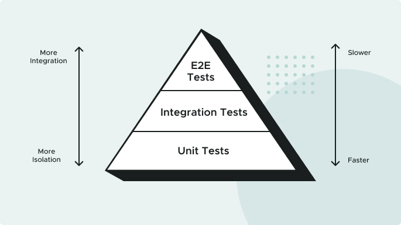

# 🌱 Spring and Spring Boot Overview

Spring and Spring Boot are Java frameworks that help developers build applications in an efficient and scalable way. Think of them as toolkits for organizing and structuring code.

---

## 🌼 Spring

Spring is a **comprehensive framework** that offers a variety of modules to support different types of applications.

For this project **Cash Card API**, we use:
- **Spring MVC** for the web app
- **Spring Data** for data access
- **Spring Security** for authentication and authorization

> ⚠️ Spring's versatility can make setup a bit complex. Developers often need to configure different components manually to get everything running.

---

## 🚀 Spring Boot

Spring Boot simplifies the Spring experience! 🧰 It like an **opinionated version of Spring**—it comes with many pre-configured settings and dependencies commonly used in Spring apps. This makes it super easy to get started without manual setup.

Spring Boot includes an **embedded web server**— we don’t need an external server to deploy web apps.

### Summary
- **Spring:** Powerful, flexible but can be overwhelming.
- **Spring Boot:** Streamlined, fast to set up, with many built-in features.

---

## 🔄 Spring's Inversion of Control Container

Spring Boot utilizes Spring Core’s **Inversion of Control (IoC) container**. This feature will be essential for this application.

💡 **Inversion of Control** gives you flexibility with dependencies. You can specify different configurations for different scenarios (e.g., local development vs. production database) without hard-coding.

- Often, **dependency injection (DI)** is used within IoC, although not exactly the same thing.
- In Spring, the terms are often used interchangeably.

More about [Spring’s IoC Container](https://docs.spring.io/spring-framework/reference/core/beans.html) in the official docs.

---

## 🛍️ Spring Initializr

When starting a new Spring Boot project, **Spring Initializr** is the way to go. It is where you configure what you need and select dependencies for the app.

- Fill in project metadata, add dependencies, and generate a complete, ready-to-run **Spring Boot application**.
---

# 🌐 API Contracts & JSON

How should the API behave?

- How should API consumers interact with the API?
- What data do consumers need to send in various scenarios?
- What data should the API return to consumers, and when?
- What does the API communicate when it's used incorrectly (or something goes wrong)?

We should document these agreements not only in a shared documentation system, but also in a way that supports automated tests passing (or failing) based upon these decisions.

This is where the concept of contracts comes in.

## 🤝 API Contracts
The software industry has adopted several patterns for capturing agreed-upon API behavior in documentation and code. These agreements are often called "contracts". Two examples include Consumer Driven Contracts and Provider Driven Contracts. 

We define an API contract as a formal agreement between a software provider and a consumer that abstractly communicates how to interact with each other. This contract defines how API providers and consumers interact, what data exchanges looks like, and how to communicate success and failure cases.

The provider and consumers do not have to share the same programming language, only the same API contracts. For this project, there's one contract between the Cash Card service and all services using it. Below is an example of that first API contract.
```json
Request
    URI: /cashcards/{id}
    HTTP Verb: GET
    Body: None

Response:
    HTTP Status:
        200 OK if the user is authorized and the Cash Card was successfully retrieved
        401 UNAUTHORIZED if the user is unauthenticated or unauthorized
        404 NOT FOUND if the user is authenticated and authorized but the Cash Card cannot be found
    Response Body Type: JSON
    Example Response Body:
        {
        "id": 99,
        "amount": 123.45
        }
```

### 💡 Why Are API Contracts Important?
API contracts are important because they communicate the behavior of a REST API. They provide specific details about the data being serialized (or deserialized) for each command and parameter being exchanged. The API contracts are written in such a way that can be easily translated into API provider and consumer functionality, and corresponding automated tests.

## 📄 What Is JSON?
JSON (Javascript Object Notation) provides a data interchange format that represents the particular information of an object in a format that you can easily read and understand.

```json
{
  "id": 99,
  "amount": 123.45
}
```
Other popular data formats include YAML (Yet Another Markup Language) and XML (Extensible Markup Language). When compared to XML, JSON reads and writes quicker, is easier to use, and takes up less space. You can use JSON with most modern programming languages and on all major platforms. It also works seamlessly with Javascript-based applications.

For these reasons, JSON has largely superseded XML as the most widely used format for APIs used by Web apps, including REST APIs.

---
# 🧪 Testing First

## What Is Test Driven Development (TDD)?

Typically, automated tests are written **after** the application feature code, but in **Test Driven Development (TDD)**, tests are written **first**! By defining expected behavior before implementation, TDD helps us design the system based on what we **want it to do**, rather than what it already does.

### 🔍 Why Use TDD?
- TDD ensures we write only the **minimum code** necessary to meet the requirements.
- Passing tests mean both working code and a safeguard against future regressions.

**Not sure how to get started with TDD?** No worries—you’ll gain hands-on practice test-driving the **Family Cash Card application** throughout this course! 💳

---

## 📐 The Testing Pyramid

Different types of tests have unique roles and impact at various levels of the system. Balancing **speed**, **maintenance cost**, and **confidence** forms the “testing pyramid”:

1. **Unit Tests**:
    - **Scope**: Tests isolated “units” of the system.
    - **Characteristics**: Simple, fast, and abundant.
    - **Purpose**: Essential for designing cohesive, loosely coupled software.

2. **Integration Tests**:
    - **Scope**: Tests a group of units working together.
    - **Characteristics**: Slower and more complex than unit tests.
    - **Purpose**: Ensures components interact correctly.

3. **End-to-End Tests**:
    - **Scope**: Tests the entire system from the user’s perspective.
    - **Characteristics**: Slow, often fragile, but thorough.
    - **Purpose**: Validates that the system works as a whole.

---

## 🔄 The Red, Green, Refactor Loop

How can development teams **move fast and stay reliable**? By continuously **refactoring** to keep code clean and manageable, supported by a solid test suite. The **Red, Green, Refactor loop** is central to TDD:

- **Red**: Write a failing test that defines the desired functionality.
- **Green**: Implement the simplest solution to make the test pass.
- **Refactor**: Simplify and improve code without changing functionality.

🔁 **Repeat** until you’ve built the functionality you need, with robust tests to back it up!

---
