# 📖 Defining the Spring Framework

### 💡 What is a Framework?
- **Framework:** A reusable set of software components that provides a structure for building applications.
- **Purpose:** Helps developers build applications faster and more efficiently by offering pre-built components.
- **Difference from Libraries:**
  - Libraries contain code that you can call and control.
  - Frameworks invert this control — they manage the flow, which is known as **Inversion of Control (IoC)**.

### 🌱 Introduction to Spring
- **Spring Framework:** An open-source, lightweight, Dependency Injection (DI) container and framework for building Java enterprise applications.
- **Application Server:** Not required, but Spring apps can be deployed on Java EE servers.
- **Non-Invasive:**
  - No need to extend framework classes or implement interfaces in most cases.
  - Enables writing code as **Plain Old Java Objects (POJOs)**.
- **Low Overhead:** Spring jars are relatively small, minimizing performance impact.

### 🛠️ Dependency Injection (DI) Container
- **DI Container:** Spring manages object dependencies automatically.
- **Object Lifecycle:** Spring instantiates and injects dependencies, serving as a lifecycle manager.

### 🌿 Beans in Spring
- **Beans:** Core objects in Spring managed by the IoC container.
  - Instantiated, assembled, and managed by Spring.
  - Defined in configuration metadata that Spring uses to reflect dependencies and manage interactions.

# 🏢 Enterprise Application Challenges
- **Complex Environment:** Must handle a diverse range of technologies, architectures, and deployment platforms:
  - **Infrastructure:** Containerization, cloud, microservices.
  - **Data Management:** JDBC, Transactions, ORM/JPA, NoSQL.
  - **Event Processing:** Events, Streaming, Reactive, Messaging (JMS, AMQP).
  - **Task Management:** Scheduling and Task handling.
  - **Security:** OAuth2, OpenID Connect.
  - **Monitoring:** Observability and monitoring tools.
  - **... and more.**

- **Spring's Role:** Provides framework classes, interfaces, and annotations to simplify integration with these technologies.
- **Flexible and Customizable:** Highly extensible and adaptable to different enterprise needs.

# 🎯 Goal of the Spring Framework
- **Purpose:** Offers comprehensive infrastructural support for developing Java enterprise applications.
  - **Spring handles the "plumbing":** Manages low-level functionality, allowing you to focus on business logic.

- **Core Principles:**
  - **DRY (Don't Repeat Yourself):** Avoid redundancy in code.
  - **Separation of Concerns:** Keep different aspects of your application isolated and modular.
  - **Convention over Configuration:** Use sensible defaults to reduce the need for manual setup.
  - **Testability:** Designed to make applications easier to test.


---

# 📝 POJO (Plain Old Java Object)

- **Definition:** A simple Java class not bound by any frameworks or specific restrictions, making it flexible and reusable across Java programs.

### 🧩 Characteristics of POJOs
- **No Special Restrictions:**
  - No specific naming conventions for properties or methods.
  - No framework-imposed rules or limitations.

- **Framework Agnostic:**
  - Usable in any Java program without dependency on a particular framework.

- **Data Modeling:**
  - Often used to represent data models, like user details or product information.

- **Data Transfer:**
  - Can act as a vehicle for transferring data across different parts of an application.

- **Data Persistence:**
  - Useful for persisting data to databases or other storage solutions.

- **Easy Debugging & Testing:**
  - Simplifies debugging and testing, as standard Java debugging tools can be used.

---

Spring Bean
Please note that if you define a class that doesn’t follow the guidelines of being a Spring Bean, the Java compiler will never complain you. In contrast, the Spring Container will complain you that it is unable to find any Spring Bean at runtime. Hence, it is the programmer’s responsibility to mark a class as a Spring Bean so that the Spring Container can recognize it manage its life cycle accordingly.
# 🌱 Spring Bean

### 📝 Key Points about Spring Beans
- **Compiler Flexibility:** If a class is not defined as a Spring Bean, the Java compiler won’t raise an error, but the Spring Container will indicate it can’t locate a Bean at runtime.
- **Developer Responsibility:** It’s up to the developer to mark classes correctly so the Spring Container can recognize and manage them properly.

### 🔹 What is a Bean Class/Component Class?
- **Definition:** A Bean is a Java class that holds **state** (non-static member variables) and **behavior** (methods), with the state contributing to the business logic within the behavior.
- **Access Control:** It's recommended to use **private** member variables (state) with **public** methods (behavior) to enforce encapsulation.
  - **Examples:** Service classes, DAO classes, etc.
- **Terminology:**
  - **Bean:** Term from Sun Microsystems.
  - **Component:** Equivalent term from Microsoft.
  - These terms are often used interchangeably.

### 🔄 Difference Between Java Bean & Bean Class
- **Java Bean:**
  - A class with **state, behavior, and standard getters/setters**.
  - Does **not** include business logic.
- **Bean Class:**
  - A class with **business logic methods**.
- **Guidelines:** This distinction is only conceptual; the compiler does not enforce these guidelines.

### 🌱 What is a Bean in Spring?
- **Spring Bean:** A Java class whose object is instantiated and managed by the Spring Container.
- **Compatibility:** Any class (e.g., POJO, Java Bean) can be a Spring Bean, except for **abstract classes** and **interfaces**.
- **Flexibility:** Allows any class to be managed as a Spring Bean if properly annotated or configured.

# 🌱 Marking a Class as a Spring Bean

To ensure the Spring Container recognizes a class as a Spring Bean, we need to mark it in the **XML configuration file** or by using **annotations**.

### 📄 Using XML Configuration
- Use the `<bean>` tag in an XML configuration file to define a class as a Spring Bean.
- This instructs the Spring Container to manage the bean's lifecycle, including:
  - Loading the class
  - Creating and managing instances
  - Destroying the class when no longer needed

#### Example:
```xml
<bean id="employee" class="com.dev.example.Employee"/>
```
- id: Specifies the internal name for the Spring Bean instance.
- class: Fully qualified name of the Java class.

🏷️ Using Annotations
- **@Component:** The most common annotation to mark a class as a Spring Bean.
- When added to a class, the Spring Container automatically considers it a Bean.
- Other Annotations: Alternatives like @Service, `@Repository`, and `@Controller` are also used to mark Beans for specific roles, but `@Component` is the base-level, widely-used annotation.

```java
@Component
public class Employee{
}
```
# 🌱 Spring Bean Naming & Additional Configurations

### 🏷️ Default Bean Naming
- **Default Name**: If no name is provided, the class name (with the first letter in lowercase) is used as the Spring Bean name.
  - **Example**: `Employee` class becomes `"employee"` by default.
- **Custom Name**: You can specify a custom name using `@Component("employee")`.

### 🔹 Stereotype Annotations
- **@Component**: General-purpose annotation to mark a class as a Spring Bean.
- **Specialized Stereotypes**: Other annotations like `@Service`, `@Repository`, and `@Controller` serve specific purposes but are variations of `@Component`.
- **Automatic Registration**: During component scanning, Spring detects `@Component` (and its specializations) and registers the class as a Spring Bean in the Application Context.

### ⚙️ Using Java-Based Configuration (Since Spring 3.0)
- **@Configuration**: Marks a Java class as a source of Bean definitions.
- **@Bean**: Marks methods within a `@Configuration` class to register returned objects as Spring Beans, similar to `<bean/>` in XML.

#### Example:
```java
@Configuration
public class AppConfig {
    
    @Bean
    public Employee employee() {
        return new Employee();
    }
}
```
- **@Configuration:** Tells Spring to treat this class as a configuration source.
- **@Bean:** The method employee() returns an Employee object registered as a Spring Bean.

---
Module 2

- Spring separate application configuration from application objects (beans)
- Spring manages your application objects
  - creating them in the correct dependency order (when a method requires another class/method through constructor arguments, factory method arguments, or properties)
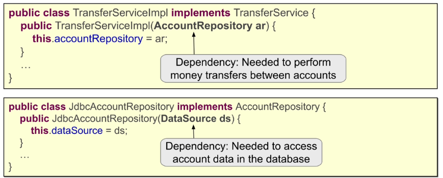
  - ensuring they are fully initialized before use
Order:
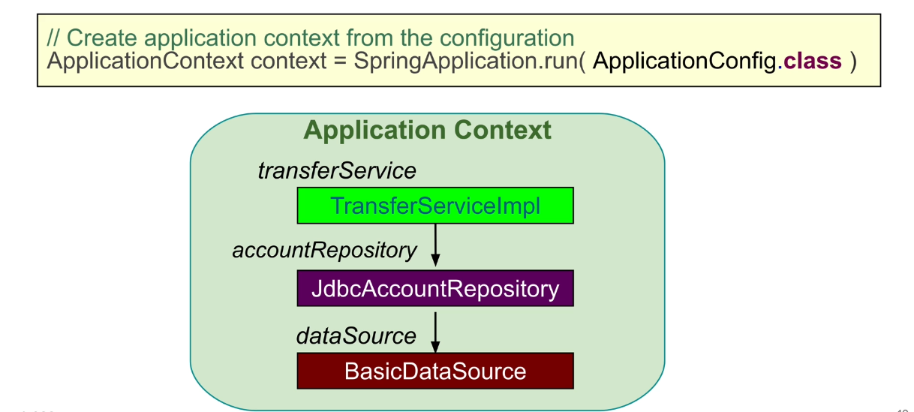
  - each bean is given a unique id/ name

ApplicationConfig is used to define/create the other beans. And it is also a bean.
Bean ID based if not defines, is based in the method name.
How to acess a bean programmatically:: 
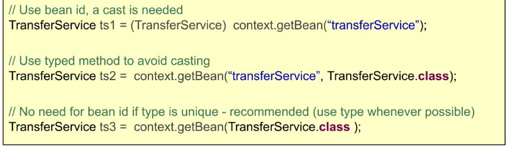

---

Creating a Spring Application Context
- Spring application context represents Spring DI container
- Spring beans are managed through the application context
- Spring application context can be created in any environment, including
  - Standalone application
  - Web application
  - JUnit test

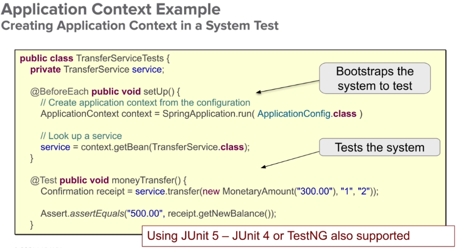


---

Creating an Application Context from Multiple Configurations
- Your @Configuration class can get too big
  - Instead, use multiple config. files combined with @Import
  - Defines a single Application Context
    - Beans sourced from multiple files
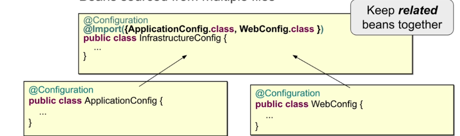

- Separation of Concerns Principle
  - Keep related beans in the same @Configuration
- Best Practice: separate "application" & "infrastructure"
  - Infrastructure often changes between environments.
  
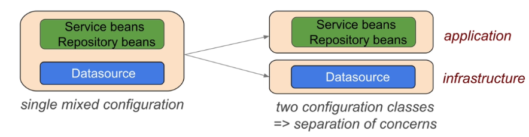
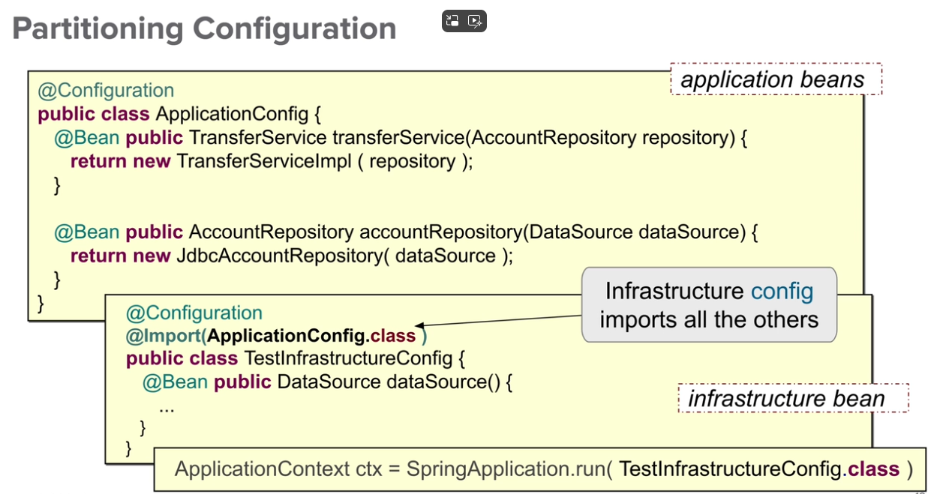


Java configuration with DI
- Use @Autowired to inject a bean defined elsewhere

- 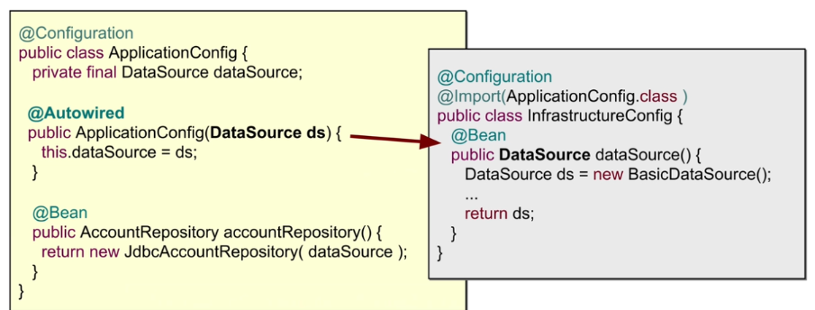

Bean definitions: recepies to create components.
- Default scope: Singleton
- The component is initialized once, and cached in the application context.
- if we try to call the same bean (with same id) multiple times, it's going to be the same instance.
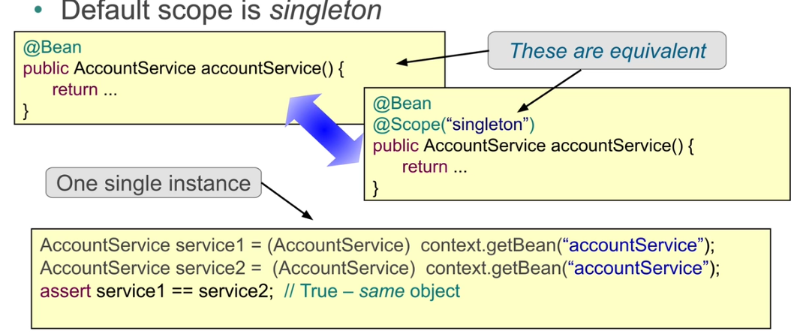
Implications for Singleton Beans: 
- Typical Spring application - backend web server
  - Multiple requests in parallel
    - Handled by multiple threads
  - Implications: multiple threads accessing singleton beans at the same time
- Handle multi-threading issues
  - Use stateless or Immutable beans
  - Use synchronized (harder)
  - Use a different scope

Bean scope : prototype
  - New instance created every time bean is referenced

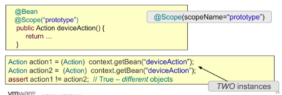

Most commonly used scopes are:
- singleton - Single instance is used
- prototype - a new instance is created each time the bean is referenced
- session - a new instance is created once per user session - web environment only
- request - a new instance is created once per request - web environment only

Other scopes:
- Web socket scope
- refresh scope
- thread scope (defined but not registered by default)
- Custom scopes (rarely)
  - You define a factory for creating bean instances
  - register to define a custom scope name

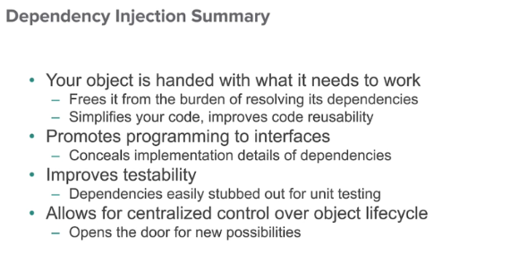

While you will likely use Annotation-based Configuration (that you will see in the Component Scanning module),
Java Configuration is the most flexible option that carries the spirit of Factory or Builder type patterns.
You will see this recurring in Spring Boot Auto-configuration projects, as well as projects where you may want to create beans that you cannot annotate.
Such examples include 3rd party code, or legacy code you are not allowed to modify.

For best practices, a bean’s name should describe the service it provides.
It should not describe implementation details.
For this reason, a bean’s name often corresponds to its interface.

Constructor injection: heavily used in modern Spring code.
Constructor injection is favored over field injection:
Easier to test.
Safer than field injection, particularly when forcing immutability of injected members through final.
Ability to decouple domain POJOs from Spring.

@Configuration //The @Configuration tells Spring to treat this class as a set of configuration instructions to be used when the application is starting up.


